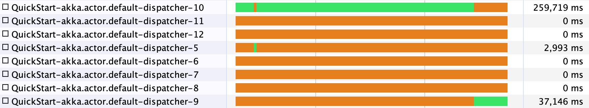
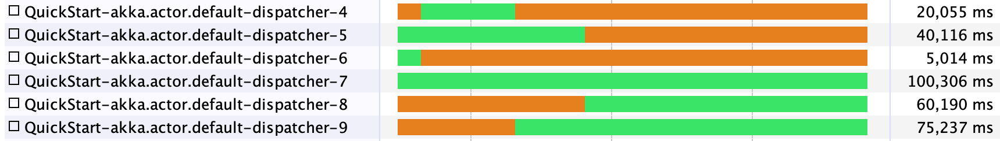

# A test with parallelizing streams with Broadcast

In the documentation for the [`Broadcast` operator](https://doc.akka.io/docs/akka/current/stream/operators/Broadcast.html),
an example is given to make downstreams of Broadcast to run in parallel.

> Note that asynchronous boundary for the output streams must be added explicitly if it’s desired to run them in parallel.

```scala
RunnableGraph.fromGraph(GraphDSL.create(countSink, minSink, maxSink)(Tuple3.apply) {
  implicit builder => (countS, minS, maxS) =>
    import GraphDSL.Implicits._
    val broadcast = builder.add(Broadcast[Int](3))
    source ~> broadcast
    broadcast.out(0) ~> Flow[Int].async ~> countS
    broadcast.out(0) ~> Flow[Int].async ~> minS
    broadcast.out(0) ~> Flow[Int].async ~> maxS
    ClosedShape
})
```

Running this graph with a 10ms delay added to processing every element at the 3 `Sink`s
will take about 3 seconds.
It's not done in parallel.

By making each delay 1 second long, we can take a better look
at the threading with more detail.
It does jump a bit, but the executions do not overlap.



## Actually parallelizing

Adding `.async` **before** the CPU heavy `Flow` does not work,
but adding it  **to** the flow does the trick.
Note that `Sink.fold` is the combination of `Flow.fold` and `Sink.head`.
The change here is to call `Flow.fold`, then call `.async`,
and connect it to a `Sink.head`.

The graph then takes about 1 second when each element takes 10ms.

Below is a VisualVM screenshot
showing the processing of 100 elements,
and every element takes 1 second.


